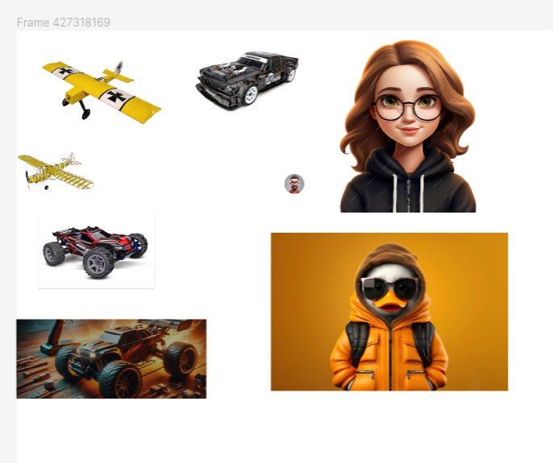
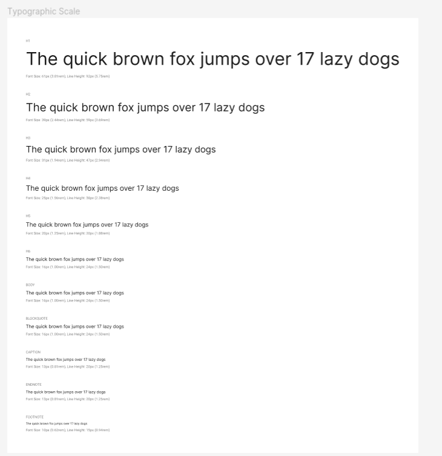
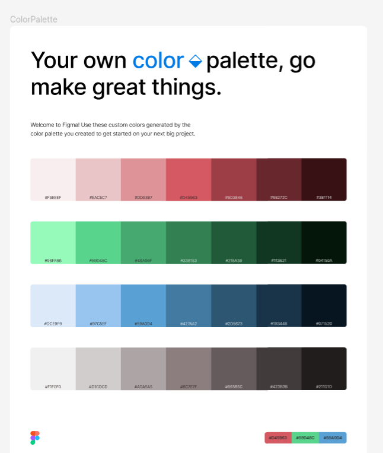
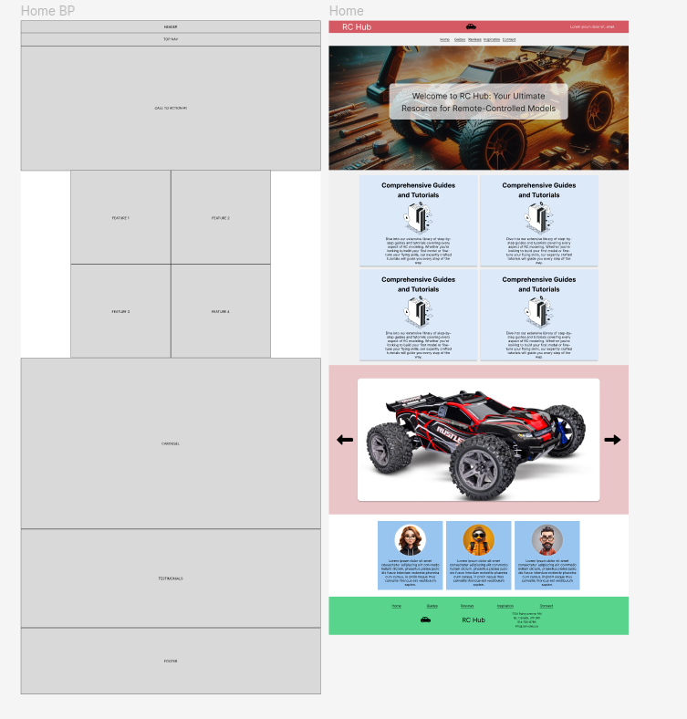

# CCS310-101 Team Project

Live Url: https://cccs310.101api.dev/

Github: https://github.com/berubenic/CCS310-101

## How to run locally

Requirements: PHP installed

Make sure you are at the root of the folder

`php -S 127.0.0.1:8000`

Visit http://127.0.0.1:8000

### Assets

